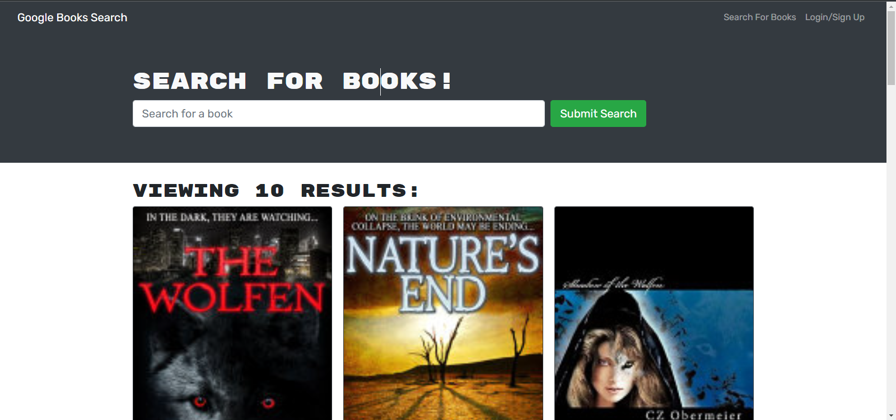
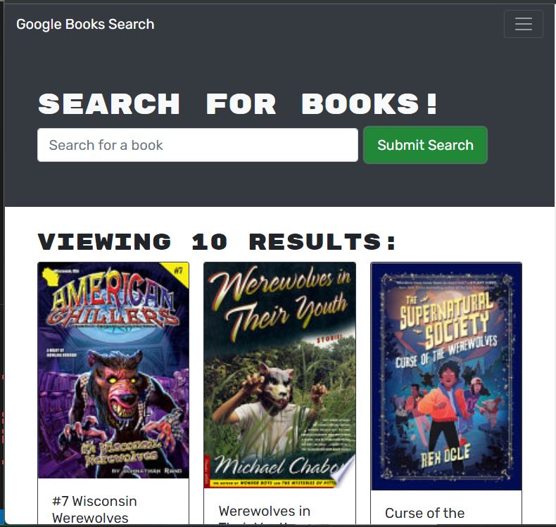
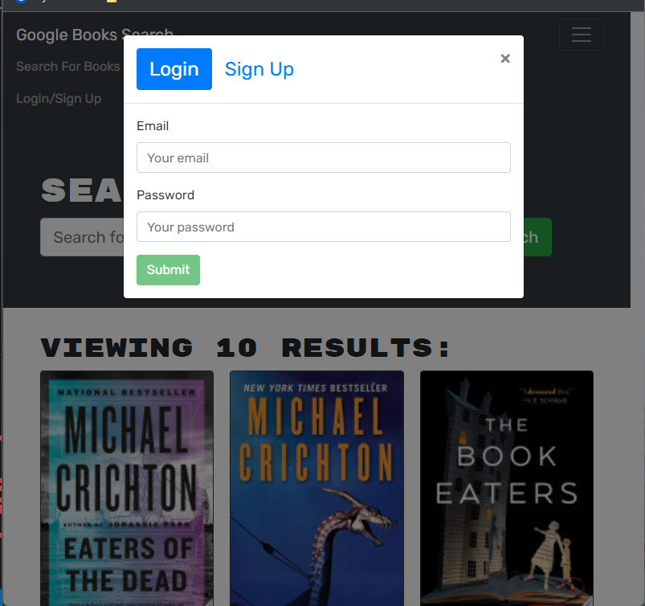
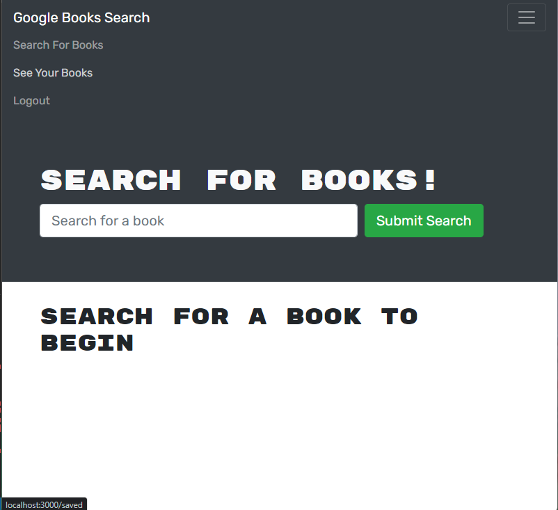

# MERN BOOK SEARCH ENGINE
**MERN Book Search Engine** is an application built using HTML, CSS, JS, Json, prettier, express node.js, Mongodb, Mongoose, Apollo Server, graphgql, dotenv, Heroku, React.


## Images of the deployed website:
***

## Home Page


## Home Page Search #2


## Login 


## Logout


## Sign Up


## User Story

```md
AS AN avid reader
I WANT to search for new books to read
SO THAT I can keep a list of books to purchase
```


## Acceptance Criteria

```md
GIVEN a book search engine
WHEN I load the search engine
THEN I am presented with a menu with the options Search for Books and Login/Signup and an input field to search for books and a submit button
WHEN I click on the Search for Books menu option
THEN I am presented with an input field to search for books and a submit button
WHEN I am not logged in and enter a search term in the input field and click the submit button
THEN I am presented with several search results, each featuring a book’s title, author, description, image, and a link to that book on the Google Books site
WHEN I click on the Login/Signup menu option
THEN a modal appears on the screen with a toggle between the option to log in or sign up
WHEN the toggle is set to Signup
THEN I am presented with three inputs for a username, an email address, and a password, and a signup button
WHEN the toggle is set to Login
THEN I am presented with two inputs for an email address and a password and login button
WHEN I enter a valid email address and create a password and click on the signup button
THEN my user account is created and I am logged in to the site
WHEN I enter my account’s email address and password and click on the login button
THEN I the modal closes and I am logged in to the site
WHEN I am logged in to the site
THEN the menu options change to Search for Books, an option to see my saved books, and Logout
WHEN I am logged in and enter a search term in the input field and click the submit button
THEN I am presented with several search results, each featuring a book’s title, author, description, image, and a link to that book on the Google Books site and a button to save a book to my account
WHEN I click on the Save button on a book
THEN that book’s information is saved to my account
WHEN I click on the option to see my saved books
THEN I am presented with all of the books I have saved to my account, each featuring the book’s title, author, description, image, and a link to that book on the Google Books site and a button to remove a book from my account
WHEN I click on the Remove button on a book
THEN that book is deleted from my saved books list
WHEN I click on the Logout button
THEN I am logged out of the site and presented with a menu with the options Search for Books and Login/Signup and an input field to search for books and a submit button  
```
 
  ## Features
  ***
  
  Features of the deployed application and repository are as follows:

  ## THIRD PARTY APIs
  ***
   Google |   [Google Apis Books](https://www.googleapis.com/books/v1/volumes?q%3Dharry%2Bpotter)
   
   <br>

   Trefle is a botanical API and data source.
   
 
   [Google Apis Books](https://www.googleapis.com/books/v1/volumes?q%3Dharry%2Bpotter)
  
  ## TECHNOLOGY USED
  ***
    HTML, 
    CSS, 
    JS, 
    Json, 
    prettier, 
    express 
    node.js, 
    Mongodb, 
    Mongoose, 
    Apollo Server, 
    graphgql, 
    dotenv, 
    Heroku,
    React

## THE DEPLOYED REPO CAN BE FOUND AT THE FOLLOWING URL:
***

[Deployed URL]

  ## INSTALLATION OF THE REPO FROM GITHUB
  ***
  A copy of the repository can be cloned at  [Click Here](https://github.com/Lycanchic/mern-Book-search-engine.git)
    * Simply click on the repo and select **Clone**. 
    * From the drop down menu select the copy icon. Type (directly into your terminal):
    ```
    'git clone' + 'the repo link' + enter.
     


- - -
© 2022 Trilogy Education Services, LLC, a 2U, Inc. brand. Confidential and Proprietary. All Rights Reserved.